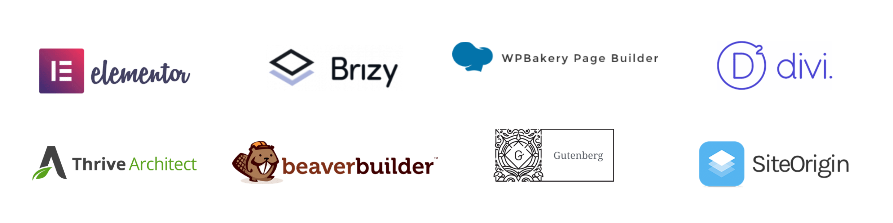

## séance 6 - les "page builders".

les "page builders" et l'aventure Gutenberg... 

### Les page builders

Les "page builders" WordPress sont un type d'outils apparus dans les années 2010, permettant de construire des mises en page à l'intérieur des pages et articles de WordPress.

Parmi les "page builders", voici quelques-uns des plus populaires:

- Elementor (depuis 2016)
- Beaver Builder
- SiteOrigin
- Divi Builder, par Elegant Themes (depuis 2013)
- Visual Composer, par WPBakery

### Les thèmes "à tout faire"

Des thèmes comme **[Astra](https://wpastra.com/)**, **[GeneratePress](https://generatepress.com/)**, **[OceanWP](https://oceanwp.org/)**, s'imposent comme thèmes "ultra-configurables" en alliance avec Elementor. Ces thèmes s'accompagnent de librairies de "templates", pour produire rapidement un visuel très complet.

Elementor sort en 2019 son thème **[Hello](https://elementor.com/hello-theme/)**, un thème "simple et léger", évidemment 100% compatible avec Elementor.

### Arrivée de Gutenberg

Le projet Gutenberg est annoncé en 2017, en développement pendant une année... et devient l'éditeur par défaut de WordPress 5.0 en décembre 2018. C'est une énorme transition, la plus grande innovation dans WordPress depuis ses 15 ans d'existence!

Voir [la vidéo d'annonce](https://wordpress.tv/2017/12/04/matt-mullenweg-state-of-the-word-2017/) du projet Gutenberg au WordCamp Europe 2017.

#### L'extension Gutenberg

Amener un changement aussi important dans un projet utilisé sur *des centaines de millions de sites* est une entreprise délicate.

[L'extension Gutenberg](https://fr.wordpress.org/plugins/gutenberg/), pendant la phase développement, a permis de tester cette nouvelle interface (dans le but de détecter des bugs et problèmes de comptabilité). 

Depuis la sortie de WP 5.0 elle n'est plus nécessaire, le nouvel éditeur étant là par défaut. Elle sert désormais au développement de nouvelles fonctionnalités dans l'éditeur. 

L'installer équivaut donc à tester la *version beta* de l'éditeur, pour bénéficier de nouveautés qui arriveront dans la version standard 3 à 6 mois plus tard.

#### Gutenberg vs les autres extensions

Quelle solution adopter, entre Gutenberg et les Page Builders? Voici un article d'opinion de Jean-Baptiste Audras : "[Gutenberg ou Page Builder : que choisir pour votre site WordPress ?](https://www.whodunit.fr/gutenberg-ou-page-builder-que-choisir-pour-votre-site-wordpress/)"

### Extensions pour étendre Gutenberg

Certaines extensions augmentent les capacités de Gutenberg en ajoutant de nouveaux types de block, ou en donnant plus de contrôle à des paramètres comme les espacements ou la typographie.

Voici un Tag pour trouver des extensions pour Gutenberg sur WordPress.org :

https://wordpress.org/plugins/tags/gutenberg-blocks/

Notamment:

- Generate Blocks, donne plus de contrôle: https://generateblocks.com/
- [The Ultimate Gutenberg Blocks Library](https://fr.wordpress.org/plugins/ultimate-addons-for-gutenberg/), par Brainstorm Force (qui produit le thème Astra).
- [Kadence](https://www.kadenceblocks.com/): ajoute notamment une gestion du responsive.
- [Stackable](https://wpstackable.com/).

### Le futur: Full Site Editing

> Amorcé par le développement de l’éditeur Gutenberg, le projet full site editing (FSE) de WordPress, qui pourrait être lancé avec la version 5.8 en juillet prochain, constitue la nouvelle « *expérience de gestion de site native* » du CMS. 

Lire un article par Alexandra Patard: "[Tout savoir sur Full Site Editing](https://www.blogdumoderateur.com/wordpress-full-site-editing-evolution-cms/)".
