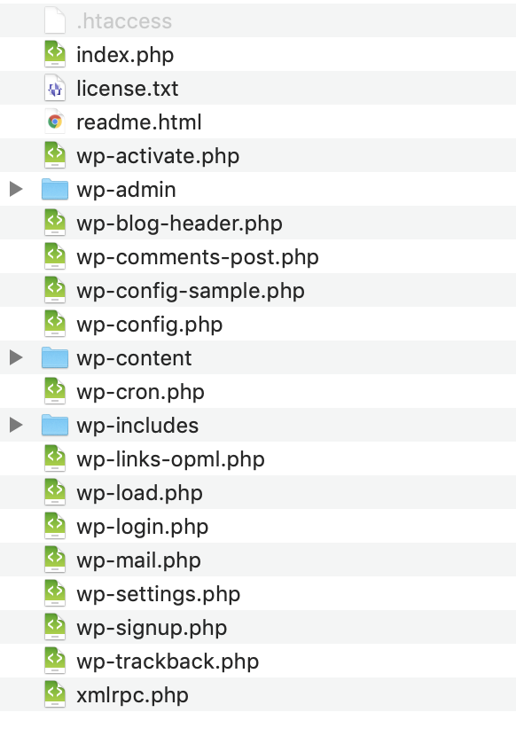

## 11 juin : séance 7 - les fichiers techniques

Nous avons vu comment utiliser l'interface de WordPress, mais comment sont organisés les fichiers?

Voici les fichiers que vous trouvez dans une installation WordPress, sur votre serveur:

Cas de figure étudiés:

Les extensions:

- Comment trouver le dossier des extensions: c'est wp-content/plugins.
- Désactiver une extension en la renommant.
- Trouver le fichier wp-config.php, avec l'identifiant de la base de données.